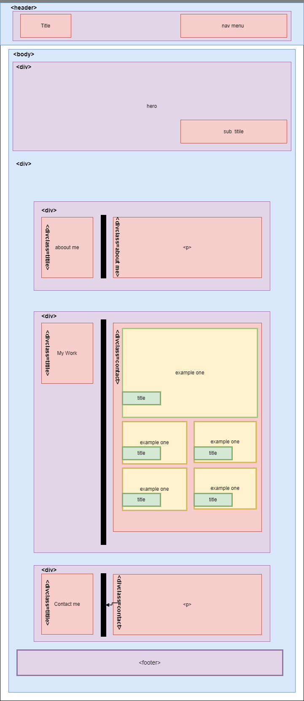

# Advanced CSS: Portfolio 

### Contains: HTML & CSS

I was given the task of replicating a website souly from a given GIF file. Upon first inspection, I noted the main areas of the website and replicated those in a WireFrame image that I developed. This wire frame was crucial in allowing me to map out the HTML and the necessary CLASSES for my work. 
Once I built the necessary HTML, I linked it to a stylesheet, and began my work fleshing out the conetent of the website. I began with the header, built a navigation menu, linked them to the ID's I placed in their respective areas on the webpage.I then moved onto the Hero/Banner of the page. I included an image as a background in the CSS file, and through there altered its shape and padding,thus allowing me I then moved onto the major content of the webpage. Spliting it into three sections, the BIO, My Work, and My Contact. It was through emplying css and the flexbox properties that I organized and positioned the contents of the webpage. Something I found to be important in staying loyal to the original Mock Up was the inclution of the :Hover pseudo-class, it was through this that I added stylizations to the color background of links and the images included in the Work section. 
Finally I included the necessary MEDIA QUERIES for the webpages formating when presented on various screen sizes. It was through these major stages that I was able to develop the portfolio I set out to code.  

## Given: User Expirence 
```
> AS AN employer
> I WANT to view a potential employee's deployed portfolio of work samples
> SO THAT I can review samples of their work and assess whether they're a good candidate for an open position
```

## Given: Acceptance Criteria
```
> GIVEN I need to sample a potential employee's previous work
> WHEN I load their portfolio
> THEN I am presented with the developer's name, a recent photo or avatar, and links to sections about them, their work, and how to contact them
> WHEN I click one of the links in the navigation
> THEN the UI scrolls to the corresponding section
> WHEN I click on the link to the section about their work
> THEN the UI scrolls to a section with titled images of the developer's applications
> WHEN I am presented with the developer's first application
> THEN that application's image should be larger in size than the others
> WHEN I click on the images of the applications
> THEN I am taken to that deployed application
> WHEN I resize the page or view the site on various screens and devices
> THEN I am presented with a responsive layout that adapts to my viewport
```

## Given: Mock Up 
The provided GIF was the main source of insperation for the portfolio that I was meant to build. 
    

## Frame Work 
Utilizing the web-application known as DIAGRAMS.NET I developed the folowing outline for my code. This was, of course, just a jumping off point form me and is not a full represenation of the final product, just something that helped to start my coding process. 
    

## For Review
Links as provided for the assignment.

* GitHub Repo: https://github.com/jaime-gg/portfolio 
* Live Webapage: https://jaime-gg.github.io/portfolio/ 


